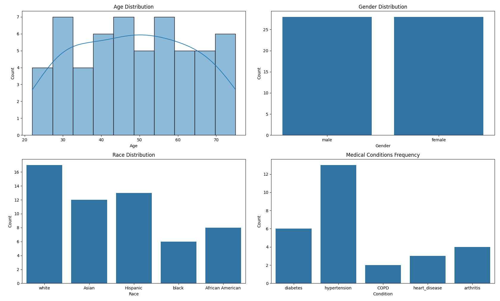

# comorbidity

# comorbidity

This project aims to analyze patient data to understand the distribution and frequency of various medical conditions and comorbidities. The data is sourced from multiple JSON files containing detailed patient descriptions, medical histories, and current health statuses.

## Project Components

### Data Files

- **main_data.json**: Contains primary patient data including demographics, medical history, and current health conditions.
- **patient_data.json**: Additional patient data focusing on specific health conditions and lifestyle factors.
- **patient_descriptions copy.json**: Detailed descriptions of patients, including their medical history, current health status, lifestyle factors, and social support.

### Requirements

The project requires the following Python packages:

- `openai`
- `python-dotenv`
- `pandas`
- `matplotlib`
- `seaborn`

These can be installed using the `requirements.txt` file.

### Visualization

The `visual.py` script reads the JSON data files, processes the data, and generates visualizations to help understand the distribution of age, gender, race, and the frequency of various medical conditions among the patients.

#### Visualizations Include:

1. **Age Distribution**: A histogram showing the distribution of patient ages.
2. **Gender Distribution**: A count plot showing the distribution of genders.
3. **Race Distribution**: A count plot showing the distribution of races.
4. **Medical Conditions Frequency**: A bar plot showing the frequency of different medical conditions such as diabetes, hypertension, COPD, heart disease, and arthritis.

### LLM Systems and Bayesian Inference

In addition to visualizations, this project explores the use of Large Language Models (LLMs) and Bayesian inference for medical use cases. By leveraging LLMs, we can generate detailed patient descriptions and potential treatment recommendations. Bayesian inference is used to update the probability estimates for various medical conditions based on new patient data, providing a probabilistic framework for decision-making in medical diagnostics.



### How to Run

1. Ensure all required packages are installed:
   ```sh
   pip install -r requirements.txt
   ```
2. Run the visualization script:
   ```sh
   python visual.py
   ```

This will generate and display the visualizations based on the patient data provided in the JSON files. Future updates will include scripts for LLM-based patient description generation and Bayesian inference for medical diagnostics.
